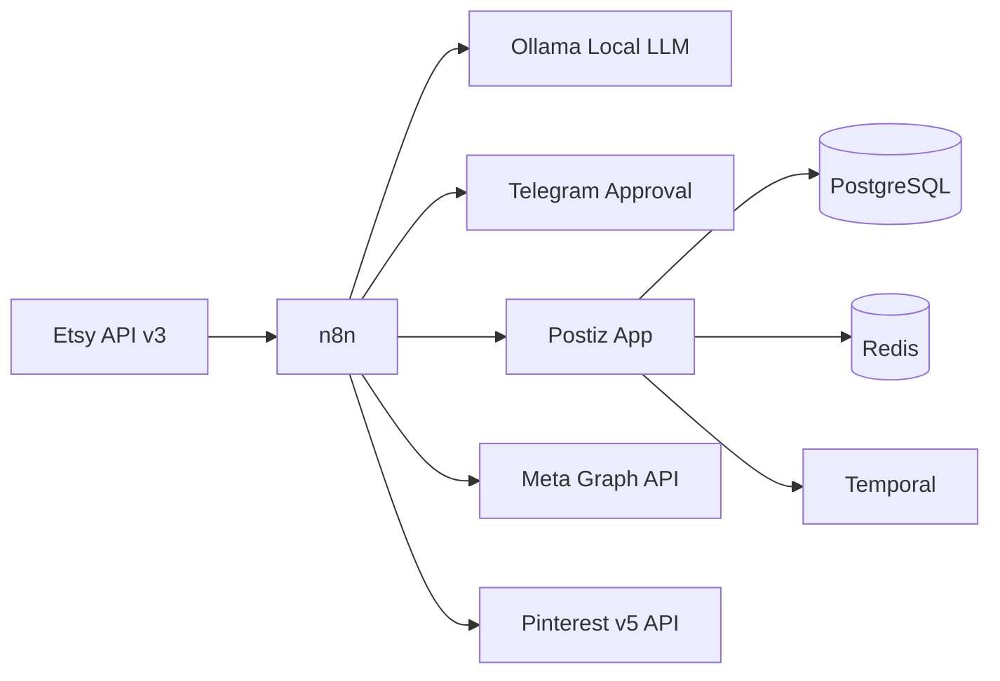
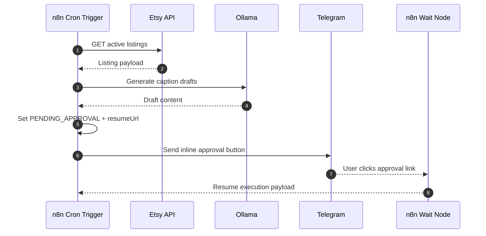
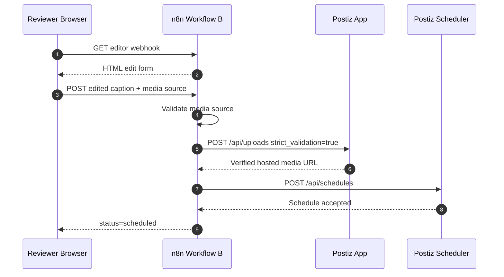
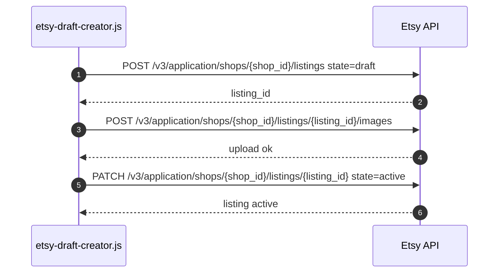

# Postiz + n8n + Ollama Architecture

This stack provides a decoupled automation system for social content generation, approval, scheduling, and telemetry normalization.

## Components

- Postiz single app service
- PostgreSQL and Redis for Postiz state
- Temporal for workflow durability
- n8n for orchestration and webhook approval loops
- Ollama for local content generation and analysis
- Etsy API v3 for listing and draft automation
- Telegram for human approval callbacks

## Runtime Topology

## Sequence: Workflow A Generator

## Sequence: Workflow B Listener + Media Gate

## Sequence: Etsy Draft Creator Utility

## Data Rules and Constraints

- n8n workflows are split into two separate templates to avoid double-trigger constraints.
- Post publishing must pass through Postiz upload validation first.
- Local filesystem media paths and unverified external URLs are rejected for scheduling handoff.
- Analytics normalization runs before LLM prompt tuning and KPI reporting.

## Normalization Math

Instagram hourly correction:

$$
 h_{local} = (h_{api} + \Delta t_{local}) \bmod 24
$$

Pinterest organic CTR:

$$
 CTR = \left(\frac{OutboundClicks}{Impressions}\right) \times 100\%
$$
